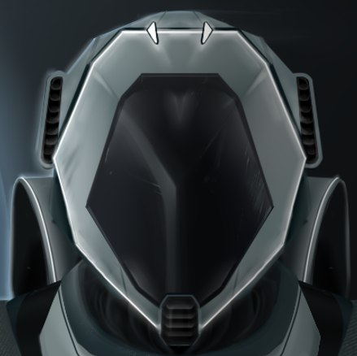

<a name="readme-top"></a>

<!-- PROJECT LOGO -->
<br />
<div align="center">
  <a href="https://github.com/ZinixZay/Ray-Casting-Game.git">
    
  </a>

  <h3 align="center">No Return</h3>

  <p align="center">
    Ray Casting game
    <br /></p>
</div>


<!-- TABLE OF CONTENTS -->
<details>
  <summary>Table of Contents</summary>
  <ol>
    <li>
      <a href="#about-the-project">About The Project</a>
      <ul>
        <li><a href="#built-with">Built With</a></li>
      </ul>
    </li>
    <li>
      <a href="#getting-started">Getting Started</a>
      <ul>
        <li><a href="#installation">Installation</a></li>
      </ul>
    </li>
    <li><a href="#usage">Usage</a></li>
    <li><a href="#roadmap">Roadmap</a></li>
    <li><a href="#contact">Contact</a></li>
  </ol>
</details>


<!-- ABOUT THE PROJECT -->
## About The Project


No return is a simple python game made using the raycasting algorithm that was used in Doom 1993. 

Of course, no one template will serve all projects since your needs may be different. So I'll be adding more in the near future. You may also suggest changes by forking this repo and creating a pull request or opening an issue. Thanks to all the people have contributed to expanding this template!


<p align="right">(<a href="#readme-top">back to top</a>)</p>


### Built With

This section should list any major frameworks/libraries used to bootstrap your project. Leave any add-ons/plugins for the acknowledgements section. Here are a few examples.

* Pygame
* Numba
* Numpy

<p align="right">(<a href="#readme-top">back to top</a>)</p>


<!-- GETTING STARTED -->
## Getting Started

The project installation option is described below

### Installation

1. Clone the repo
   ```sh
   git clone https://github.com/ZinixZay/Ray-Casting-Game.git
   ```
3. Install packages
   ```sh
   pip install -r requirements.txt
   ```

<p align="right">(<a href="#readme-top">back to top</a>)</p>


<!-- USAGE EXAMPLES -->
## Usage

The project will help pass the time

<p align="right">(<a href="#readme-top">back to top</a>)</p>


<!-- ROADMAP -->
## Roadmap

- [x] Add Raycasting Algorithm
- [x] Add Textured Walls
- [x] Add Levels
- [x] Add Menus
   - [x] Start
    - [x] Pause
    - [x] Lose
    - [x] Win
- [x] Add Readme
- [X] Add Entities
    - [x] Static
    - [x] Npc
    - [x] Packs
- [ ] Add Weapon
  - [X] Logic with weapons
  - [ ] Different weapons
- [X] Interface
 
<p align="right">(<a href="#readme-top">back to top</a>)</p>


<!-- CONTACT -->
## Contact

* Daniel Ryzhik - [@ZinixZay](https://t.me/@ZinixZay) - Developer
* Dmitrii Gorshkov - [@dmitrii1011](https://t.me/@dmitrii1011) - Developer
* Valeria Sklarova - [@chuuiqs](https://t.me/@chuuiqs) - Designer, Artist
* Nikolai Grigoriev - [@whyitsoblue](https://t.me/whyitsoblue) - Composer

Project Link: [https://github.com/ZinixZay/Ray-Casting-Game.git](https://github.com/ZinixZay/Ray-Casting-Game.git)

<p align="right">(<a href="#readme-top">back to top</a>)</p>
